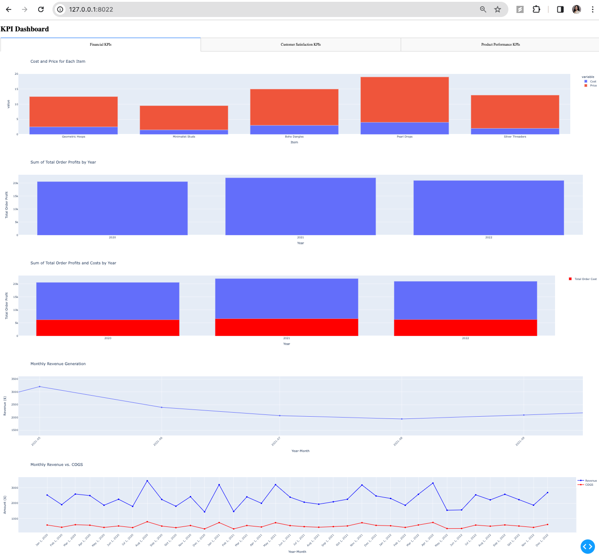
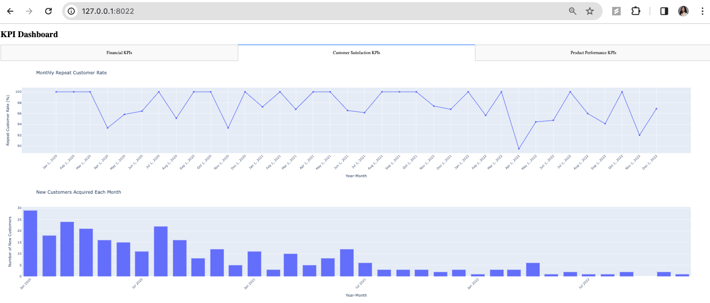
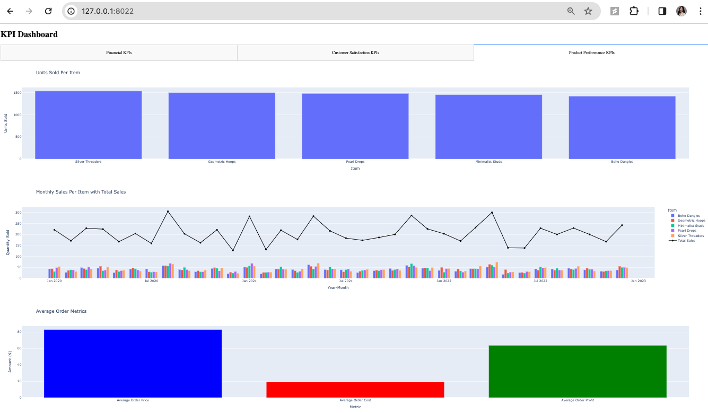

# Modular Business KPI Dashboard

This project is a Dash-based web application designed to visualize key performance indicators (KPIs) for a micro business, like a private handmade jewelry seller. It features a comprehensive dashboard that displays financial metrics, customer satisfaction indices, and product performance insights, allowing for effective business strategy planning and performance evaluation.

## Features

- **Financial KPIs Overview**: Visualizes monthly and annual revenue, costs, and profits to assess the financial health and growth of the business.
- **Customer Satisfaction KPIs**: Analyzes repeat customer rates and new customer acquisition trends to gauge customer satisfaction and loyalty.
- **Product Performance KPIs**: Offers insights into product popularity, sales trends, and inventory management through detailed item-specific sales data.




## Getting Started

These instructions will get you a copy of the project up and running on your local machine for development and testing purposes.

### Prerequisites

- Python 3.6 or higher
- pip

### Installation

1. **Clone the repository**

```bash
git clone https://github.com/leannmendoza/Modular_KPI_Dashboard.git
cd Modular_KPI_Dashboard
```
2. **Set up a virtual environment (Optional but recommended)**
```bash
python3 -m venv venv
source venv/bin/activate  # On Windows use `venv\Scripts\activate`
```

3. **Install the requirements**
   
```bash
pip install -r requirements.txt
```
### Running the Application

1. **Prepare your data**

Ensure you have the jewelry_order_form.csv and jewelry_prices.csv files in the root directory or specify their paths via command-line arguments.

2. **Start the Dash app**

```bash
python dashboard.py --order_data_path your_order_data.csv --item_cost_path your_item_cost_data.csv --date_column_name OrderDate --email_column_name Email
```
Replace your_order_data.csv and your_item_cost_data.csv with the paths to your CSV files if they are different from the defaults.
Replace OrderDate and Email with the column name that contains the date data and customer email data

your_order_data.csv.csv
This CSV file can be downloaded directly if your business takes orders from Google forms. A few columns are required for modularity to work: 
* Column that contains date data
* Column that contains email data
* Columns that match Item names in your_item_cost_data.csv

your_item_cost_data.csv
This CSV file should list all the items or services offered by your business, along with their costs and prices. The structure is as follows: [Item, Cost, Price]

3. **Access the Dashboard**

Open a web browser and navigate to http://127.0.0.1:8022/ (or the port you specified). See Line 369.

### Built With

* Dash - The main framework used for creating the web application.
* Plotly - Used for creating interactive charts.

### Authors

LeAnn Mendoza - Initial work - leannmendoza


